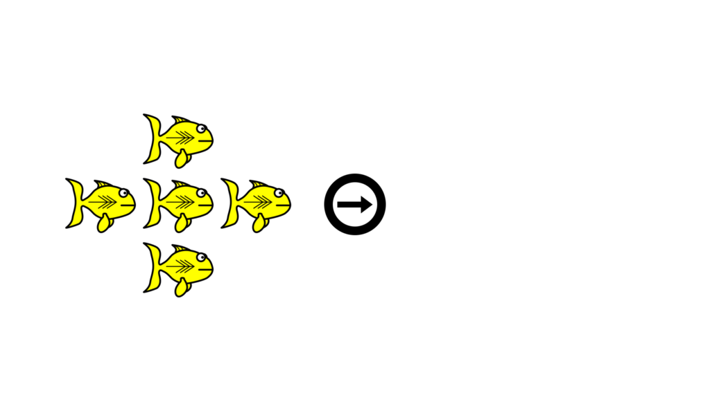

# CAST

The Combined Attention Systems Test (CAST) is a modification of the [ANT-I](https://github.com/a-hurst/ANTI) ([Callejas, Lupiáñez, & Tudela, 2004]((https://doi.org/10.1016/j.bandc.2004.02.012))) developed by [Lawrence (2018)](https://dalspace.library.dal.ca/handle/10222/74191). 



## Requirements

This version of the CAST is programmed in Python 3.7 using the [KLibs framework](https://github.com/a-hurst/klibs). It has been developed and tested on macOS, but should also work with effort on most Windows or Linux systems.

## Getting Started

### Installation

First, you will need to install the KLibs framework by following the instructions [here](https://github.com/a-hurst/klibs).

Then, you can then download and install the experiment program with the following commands (replacing `~/Downloads` with the path to the folder where you would like to put the program folder):

```
cd ~/Downloads
git clone https://github.com/TheKleinLab/CAST.git
```

### Running the Experiment

This version of the CAST is a KLibs experiment, meaning that it is run using the `klibs` command at the terminal (running the 'experiment.py' file using python directly will not work).

To run the experiment, navigate to the CAST folder in Terminal and run `klibs run [screensize]`,
replacing `[screensize]` with the diagonal size of your display in inches (e.g. `klibs run 24` for a 24-inch monitor).

If you just want to test the program out for yourself and skip demographics collection, you can add the `-d` flag to the end of the command to launch the experiment in development mode.

#### Optional Settings

When using the CAST, participants can be placed into one of two block conditions: the **endo-first** conditon, where participants complete the endogenous subtest of the CAST first, or the **exo-first** condition, where they complete the exogenous subtest of the CAST first.

To choose which condition to run, launch the experiment with the `--condition` or `-c` flag, followed by either `endo` or `exo`. For example, if you wanted to run a participant in the endo-first condition on a computer with a 19-inch monitor, you would run 

```
klibs run 19 --condition endo
```

If no condition is manually specified, the experiment program defaults to running the exo-first condition.

 

### Exporting Data

To export data from the CAST, simply run

```
klibs export
```

while in the root of the CAST directory. This will export the trial data for each participant into individual tab-separated text files in the project's `ExpAssets/Data` subfolder.
